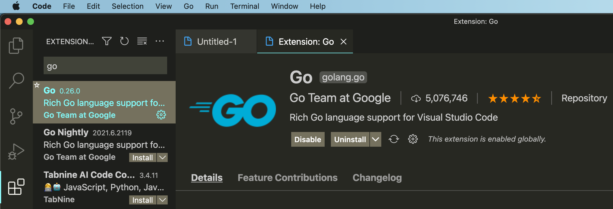
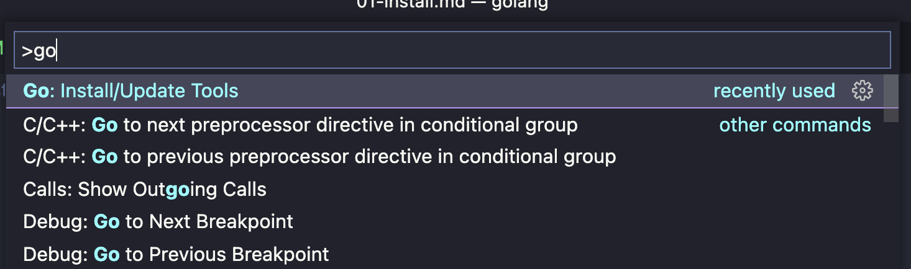
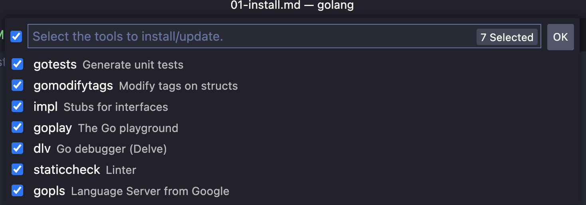

# 搭建golang开发环境

## 一、安装go语言

go语言支持多平台的操作系统

go的官网地址为：[https://golang.org](https://golang.org)

国内地址为：[https://golang.google.cn](https://golang.google.cn)

下载对应的安装包，接下来进行安装

### 1.1 UNIX/Linux 安装

以下是使用二进制安装文件的安装方式

```shell
# 解压安装包
tar -zxvf go1.19.1.linux-amd64.tar.gz

# 将安装包移到系统目录
sudo mv go /usr/local
```

设置环境变量，使用`sudo vim /etc/profile`打开系统 profile 文件，在文件末尾添加以下内容

```shell
# 这是go的安装路径，后续IDE会读取GO_ROOT的内容
export GOROOT=/usr/local/go

# 设置go的国内包加速镜像
export GOPROXY=https://goproxy.io,direct

# 将go的二进制可执行文件加入PATH环境变量中，即可在终端调用
export PATH=$GOROOT/bin:$PATH
```

最后，执行`source /etc/profile`命令系统重新加载 profile 文件

> 在 golang 中，还依赖其他的环境变量，可以使用`go nev`命令查看 golang 所有依赖的环境变量，我们在后面需要使用的时候会逐个介绍

### 1.2 mac和windows安装

windows 使用`.msi`后缀的文件双击进行安装，mac 可以使用 1 中的二进制包安装方式，也可以使用`.pkg`后缀文件双击进行安装。

最后，正确设置`GOROOT`、`GOPROXY`、`PATH` 三个环境变量即可。

### 1.3 安装验证

最后使用`go version`在命令行终端验证，如果如下 go 的版本信息，则安装成功

```shell
go version go1.19.1 darwin/amd64
```

## 二、配置开发环境

### 1. 安装 IDE

为了方便写 go 程序，我们需要安装 IDE。我们以 VS Code 为例，配置 go 的开发环境。

VS code 的官网是：[https://code.visualstudio.com/](https://code.visualstudio.com/)

下载我们电脑对应的操作系统，双击根据提示安装即可。

最后，我们打开 vs code 的插件商店安装 go 语言官方的扩展包，如下图



安装完成go插件之后，我们还需要安装go开发的相关工具。打开 VS Code 的命令行工具，找到`Go:Install/Update Tools`，如下图



按回车后勾选所有未安装的工具，最后按OK即可，如下图



### 2.2 编写第一个程序

在任意工作目录，创建`test.go`文件，添加以下内容

```go
package main

import "fmt"

func main(){
  fmt.Println("Hello World")
}
```

在命令行终端使用 go 命令执行输入结果如下

```shell
pan@pandeMBP learn % go run test.go
Hello World
pan@pandeMBP learn %
```
